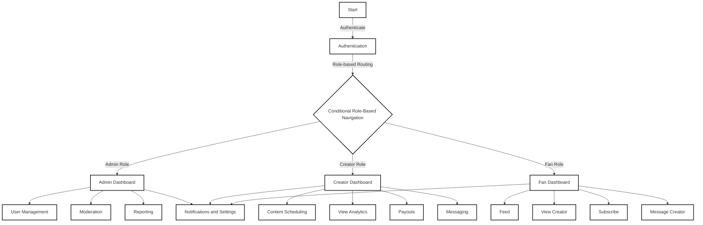

# ✨ **Next Gen Management Agency (NGMA) Project Master Document** ✨

## 🌟 **Project Branding** 🌟

- **Name**: Next Gen Management Agency (NGMA)
- **Tagline**: "By Digital Herencia"
- **Domain**: [nextgenmanagementagency.vercel.app](https://nextgenmanagementagency.vercel.app)
- **GitHub Repository**:
  - **Username**: [DigitalHerencia](https://github.com/DigitalHerencia)
  - **Repo Name**: [NextGenManagementAgency_v3](https://github.com/DigitalHerencia/NextGenManagementAgency_v3) (to be created)

**Branding Colors**

- **Accent**: `#ff00ff`
- **Alternate Accent**: `#00ffff`
- **Gradient**: `#ff00ff + #00ffff`
- **Main Text**: `#ffffff`
- **Background**: `#0a0a0a`
- **Font**: Bebas Neue

## 🛠️ **Project Overview** 🛠️

The project is a **Next.js 15-based OnlyFans Management Web App** designed for **Next Gen Management Agency (NGMA)**, branded under **"By Digital Herencia."** The app provides tools for managing creators, fans, and administrators, with a focus on scalability, modern UI/UX, and seamless deployment. The primary goal is to provide creators with comprehensive management tools, allowing them to monetize their content while providing fans an intuitive interface for accessing exclusive content.

## ✅ **Project To-Do List** ✅

### **1. Branding Setup**

- [x] **Name and Tagline Defined**
- [x] **Domain Setup**
  - Domain registered: [nextgenmanagementagency.vercel.app](https://nextgenmanagementagency.vercel.app)
- [x] **GitHub Repository Created**
  - [ ] **Repository Push**: Push project to [GitHub Repo](https://github.com/DigitalHerencia/NextGenManagementAgency_v3)
- [x] **Branding Colors Finalized**
- [x] **Font Chosen (Bebas Neue)**

### **2. Project Development**

- **Creator Dashboard**
  - [x] **Analytics Feature Defined**
  - [ ] **Content Scheduling Development**
  - [ ] **Direct Messaging System Implementation**
  - [ ] **Custom Pricing Feature for Subscription Tiers**
  - [ ] **Payment Gateway Integration for Payouts**

- **Fan Dashboard**
  - [x] **Feature List Defined**
  - [ ] **Content Feed Implementation**
  - [ ] **Messaging with Creators**
  - [ ] **Subscription Management**
  - [ ] **Payment Handling and History Tracking**

- **Admin Dashboard**
  - [x] **Feature Scope Defined**
  - [ ] **User Management Tools**
  - [ ] **Content Moderation System**
  - [ ] **App Performance and Revenue Reporting Tools**

- **Authentication System**
  - [x] **User Registration Workflow Defined**
  - [ ] **Two-Factor Authentication Setup**
  - [ ] **Role-Based Access Control Implementation**

- **Media Management**
  - [x] **Upload Feature Defined**
  - [ ] **File Compression and Optimization for Faster Delivery**

- **Notification System**
  - [x] **Notification Types Defined** (Email, In-App)
  - [ ] **In-App Notification Implementation**

- **Content Monetization Features**
  - [x] **Monetization Strategy Defined**
  - [ ] **Pay-per-view Feature Implementation**
  - [ ] **Tip System for Fans**
  - [ ] **Exclusive Content for Specific Tiers**

### **3. Legal and Security**

- [x] **GDPR Compliance Considerations Defined**
- [ ] **Secure Payments Setup (Stripe/PayPal Integration)**
- [ ] **Content Protection via Watermarking and Encryption**

### **4. UI/UX Libraries Integration**

- [x] **React 19 Framework Integrated**
- [x] **Next.js 15 for SEO and SSR Setup**
- [x] **Chakra UI and Tailwind CSS Installed**
- [ ] **Forms and Input Handling (Formik + Yup, React Hook Form)**
- [ ] **Animations (Framer Motion)**

### **5. State Management and Backend Integration**

- [x] **Redux Toolkit Installed for State Management**
- [x] **React Query Setup for Data Fetching**
- [ ] **File Upload and Media Handling (Dropzone.js, Cloudinary SDK)**
- [ ] **Authentication Setup (NextAuth.js, Firebase Auth)**
- [ ] **Payment Integration (Stripe, PayPal)**
- [ ] **Push Notifications (OneSignal, Toastify)**

### **6. Testing and Performance Optimization**

- [x] **Testing Framework Setup (Jest + React Testing Library)**
- [ ] **End-to-End Testing with Cypress**
- [ ] **Image and Video Optimization (Cloudinary)**
- [ ] **Tailwind JIT Compiler for CSS Optimization**

## 🔧 **Modern UI/UX Libraries** 🔧

- **Frontend Framework**:
  - **React 19**: Highly flexible and scalable for building interactive UI.
  - **Next.js 15**: For server-side rendering, SEO optimization, and performance.

- **UI Libraries**:
  - **Chakra UI**: Modern, accessible, and customizable components.
  - **Tailwind CSS**: For utility-first CSS styling.
  - **Framer Motion**: Advanced animations and transitions.

- **Forms and Input Handling**:
  - **Formik + Yup**: For handling forms and validation.
  - **React Hook Form**: Lightweight form management.

- **State Management**:
  - **Redux Toolkit**: Centralized and optimized state management.
  - **React Query**: For data fetching and caching.

- **Charts & Analytics**:
  - **Chart.js or Recharts**: For dynamic data visualization.

- **File Uploads**:
  - **Dropzone.js**: Drag-and-drop file upload.
  - **Cloudinary SDK**: Media optimization and delivery.

- **Authentication**:
  - **NextAuth.js**: Secure and easy-to-implement authentication.
  - **Firebase Auth**: For real-time user management.

- **Payment Integration**:
  - **Stripe SDK**: For subscription management, payments, and payouts.
  - **PayPal API**: As an alternative payment method.

- **Notifications**:
  - **OneSignal**: For push notifications.
  - **Toastify**: For in-app notifications.

- **Testing**:
  - **Jest + React Testing Library**: For unit and integration testing.
  - **Cypress**: End-to-end testing.

## 📚 **Proposed Folder Directory** 📁

```
project/
├── public/              # Static assets
├── src/
│   ├── components/      # Reusable UI components
│   ├── pages/           # Next.js page routes
│   │   ├── auth/        # Authentication pages (login, register)
│   │   ├── dashboard/   # Creator/Admin/Fan dashboards
│   │   ├── content/     # Content pages (feed, posts)
│   │   ├── settings/    # User settings
│   │   └── admin/       # Admin-specific pages
│   ├── hooks/           # Custom React hooks
│   ├── lib/             # Helper functions and API calls
│   ├── layouts/         # Page layouts
│   ├── middleware/      # Authentication and role checks
│   ├── styles/          # Tailwind CSS files
│   ├── utils/           # Utility functions
│   └── store/           # Redux store and slices
├── prisma/              # Prisma schema (for database modeling)
├── .env                 # Environment variables
├── next.config.js       # Next.js configuration
├── package.json         # Dependencies
└── tsconfig.json        # TypeScript configuration
```

## 🗒 **Flow Chart** 👇



## 📊 **Data Modeling Diagram** 📊

| **Users Table**              |
| ---------------------------- |
| `user_id (PK)`               |
| `email`                      |
| `password_hash`              |
| `role (creator, fan, admin)` |
| `created_at`                 |

| **Creators Table**              |
| ------------------------------- |
| `creator_id (PK, FK → user_id)` |
| `profile_description`           |
| `subscription_tiers`            |

| **Fans Table**              |
| --------------------------- |
| `fan_id (PK, FK → user_id)` |
| `active_subscriptions`      |
| `payment_history`           |

| **Content Table**           |
| --------------------------- |
| `content_id (PK)`           |
| `creator_id (FK)`           |
| `type (image, video, text)` |
| `title`                     |
| `file_url`                  |
| `price`                     |
| `created_at`                |

| **Subscriptions Table** |
| ----------------------- |
| `subscription_id (PK)`  |
| `fan_id (FK)`           |
| `creator_id (FK)`       |
| `tier`                  |
| `status`                |
| `started_at`            |
| `renewal_date`          |

| **Messages Table**           |
| ---------------------------- |
| `message_id (PK)`            |
| `sender_id (FK → user_id)`   |
| `receiver_id (FK → user_id)` |
| `content`                    |
| `timestamp`                  |

## 🚀 **Optimization for Ivan's Workflow** 🚀

### **Cloud Services**

- Use **Vercel** for deployment and **MongoDB Atlas** for database hosting.
- Media uploads handled with **Cloudinary** to reduce storage overhead.

### **Development Tools**

- **Visual Studio Code** with **ESLint**, **Prettier**, and **Next.js** extensions for clean and efficient coding.
- **Tailwind CSS** for rapid styling.

### **Data Security**

- **2FA** using **NextAuth.js** for user accounts.
- **Watermarking and encryption** for media content.

### **Performance**

- Use **Next.js’s API routes** for serverless functions.
- **Optimize images and videos** via **Cloudinary**.
- **Tailwind JIT compiler** for faster CSS.

## 🧑‍💻 **Development Setup** 🛠️

### **System Details**:

- **Computer**: Dell OptiPlex 3080
- **OS**: Windows 11 Pro, 64-bit (Version 23H2, OS Build 22631.4460)
- **Processor**: Intel(R) Core(TM) i5-10500 CPU @ 3.10GHz
- **RAM**: 8.00 GB
- **Development Drive**: D:\WebDev\ with ReFS file system

### **Key Directories**:

- **Next.js Apps**: D:\WebDev\Projects\NextApps
- **React Apps**: D:\WebDev\Projects\ReactApps
- **Vercel Deploys**: D:\WebDev\Projects\VercelDeploys

## 🖼 **Assets**

- **Asset Path**: D:\WebDev\Assets\NGMA_LOGO
- **Key Assets**:
  - **favicon.ico**: For browser tab icons
  - **main-black logo**: Primary branding logo
  - **shapes_black**: Background design element
  - **mark_black**: Icon used throughout the app

## 🛡️ **Current Project Details** 🛡️

- **Actual Directory Structure**:
  ```
  D:\WebDev\Projects\NextApps\NextGen_Site_v3\nextgen-site-v3
  ├── node_modules/               # Dependencies
  ├── public/                     # Public assets
  ├── src/
  │   └── app/
  │       ├── fonts/
  │       ├── favicon.ico
  │       ├── globals.css
  │       ├── layout.tsx
  │       └── page.tsx
  ├── .eslintrc.json              # ESLint configuration
  ├── .gitignore                  # Git exclusion file
  ├── next-env.d.ts               # Next.js TypeScript environment declaration
  ├── next.config.ts              # Next.js configuration
  ├── package-lock.json           # Dependency lock file
  ├── package.json                # Dependency management and scripts
  ├── postcss.config.mjs          # PostCSS configuration for Tailwind
  ├── README.md                   # Project documentation
  ├── tailwind.config.ts          # Tailwind customization
  └── tsconfig.json               # TypeScript configuration
  ```

## 🛈 **Next Steps** 🛈

1. **Create GitHub Repository**:
   - Push the project to **DigitalHerencia/NextGenManagementAgency_v3**.

2. **Asset Integration**:
   - Move assets (e.g., **favicon.ico**, logos) to **public/**.

3. **Customize Features**:
   - Start building the **authentication system** and **dashboards**.

4. **Deployment**:
   - Deploy the site to **Vercel** and verify it works on the production domain.

